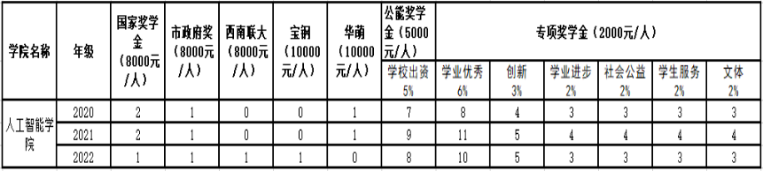

# 奖学金篇

## 总述

本科自大二起，每年9月会举行一次全校范围内的奖学金评选。面向全校本科生的奖学金分为政府奖学金和校级奖学金两大类。

* 政府奖学金：国家奖学金、天津市人民政府奖学金、国家励志奖学金
* 校级奖学金：
  * 优秀奖学金：周恩来奖学金和公能奖学金
  * 专项奖学金：学业优秀奖学金、创新奖学金、学业进步奖学金、社会公益奖学金、学生服务奖学金、文体奖学金、志愿入伍奖学金和志愿服务西部基层奖学金

需要注意的是，其中周恩来奖学金每年全校评选10位同学，只有南开大学最最最优秀的同学可以获得；国家励志奖学金、志愿入伍奖学金和志愿服务西部基层奖学金是针对性较强的奖学金，一般同学不能获得。

因此，每年9月面向大众的奖学金包括了国家奖学金、天津市人民政府奖学金、学业优秀奖学金、创新奖学金、学业进步奖学金、社会公益奖学金、学生服务奖学金、文体奖学金。另外，各学院可能还会存在企业奖学金，例如人工智能学院有宝钢、华盟奖学金等。西南联大奖学金是南开大学少数几个学院拥有的奖学金，具体情况我也不太清楚。

## 资格确定

不同奖学金的评选资格各不相同，需要你按需查看。以下若干方面需要着重注意：

* 是否有违规违纪情况
* 是否欠缴学费
* 体质测试是否合格
* A/B/C课程是否合格
* ……

辅导员会在奖学金正式评选前，在学生资助系统上发布一个“奖学金测试项目”，可以通过该测试判断自己是否有资格参加评选。

## 金额与数量分配

以2023年的评选为例，奖学金的金额和数量分配如下图所示，每年的评选数量和金额基本相同。

来源：<https://ai.nankai.edu.cn/info/1020/5447.htm>

一般来说，如果要按照评选难度排名，排序为国奖>市政府>=西南联大=企业>公能>专项。国奖是当之无愧的最高等级，一般只有排名前2名的人才能获得。市政府、西南联大、企业奖学金基本处于一个等级，市政府略高。

奖学金的分配同学之间是可以商讨的。比如，排名第3、4的同学可以获得市政府奖学金或企业奖学金，你们之间可以商量谁拿钱多的（哈哈哈哈哈）。

需要注意的是政府奖学金、校级优秀奖学金与校级专项奖学金之间不可兼得，校级专项奖学金每人至多可兼得两项。

## 评选与答辩

### 评选标准

#### 综合类奖学金（国奖、市政府、企业和公能）

综合类奖学金以学生综合成绩和公开考评成绩共同组成，计算方法为：

学生综合成绩=学年内A/B/C/D类课程平均学分绩+综合素质加分

综合考评成绩=学生综合成绩$\times70\%$+公开考评成绩$\times30\%$

比如我的A/B/C/D类课程平均学分绩为90，综合素质加分为3.5分，那么我的学生综合成绩为93.5。

公开考评会以答辩的形式进行。经验表明，综合考评成绩的排名基本与学生综合成绩的排名相同。因此，如果你已经知道自己的学生综合成绩排名，就可以基本确定可以获得什么等级的奖学金。

#### 学业优秀奖学金和学业进步奖学金

这两项奖学金会直接由你的A/B/C/D类课程成绩决定，申请时不需要额外材料。在确定综合类奖学金的获得者后，辅导员和教务老师会计算其余同学的成绩，按排名依次获得。

#### 其余专项奖学金

其余的专项奖学金会关注某一特定方面的成绩，有各自的计算方法，详见评选细则。

#### 综合素质加分

综合素质加分包含5类：

* 科研创新类：科研竞赛（如机器人竞赛、编程比赛等）、科研论文（SCI、EI、核心等）、科创项目等。
* 学习竞赛类：非专业类的竞赛，如数模国赛、美赛、大英赛、数学竞赛等。
* 社会公益类：社会实践和公益服务中所获得奖项。如暑期社会实践的优秀团队等。
* 学生服务类：担任学生干部、班级职务、“五四评优”获奖等。
* 文体活动类：文艺项目和体育项目获奖等。

不同的类别、项目、等级会对应不同的分数，具体的加分标准详见评选细则。注意加分单类加分不超过2分，超过以2分计；累计加分不超过5分，超过以5分计。

我个人的感受是，在评选综合奖学金的过程中，参选人普遍可以加3-4分，也不乏有人能加满5分。由于头部参选人的学分绩相差不过零点几分，所以若想获得综合类奖学金，综合素质加分是至关重要的部分。

奖学金的加分与保研综测的加分不同，奖学金加分的标准相对宽松，不会限制在某几个大型竞赛（如互联网+、挑战者杯、数模国赛等）之中。只要是名义上为国家级/省市级，基本上都会按照相应等级加分。也就是说，相对较水的竞赛也可以获得较多的加分。当然，我并不提倡这样做。这些竞赛除了在奖学金加分中有利用价值，让你的简历“显得”更丰富之外，其余方面作用甚微。所以，我还是建议在有含金量的比赛上多下功夫，不要只关注眼前的利益。

### 评选材料

在评选前，辅导员会先统计申请综合奖学金的学生。学生要将自己的加分项总结为一份表格文件，并与证明材料打包发送给辅导员。几天后，学院楼中会公示每个学生的加分情况。

### 答辩

全学院的学生会在一天中答辩，按照年级依次进行。如果有空，可以到现场听一听高年级的学长学姐的答辩，会受到一些心灵上的震撼，同时也会对未来的努力方向有更明晰的方向。

每位同学的答辩时间在3分钟左右。答辩的同学有人会穿正装，但是个人觉得穿着得体大方即可，穿正装也不会有什么受益。老师一般不太会提问，偶尔会问一下项目是否为负责人，论文是第几作者等等基础问题。

## 结语

每年获得奖学金的学生可以达到30%左右，不要妄自菲薄，觉得自己一定选不上；要大胆尝试，总有适合自己的赛道。除了国奖、市政府、企业奖学金之外，其余的奖学金一般会在当年的11月中旬下发，因此会被调侃为“双十一”的购物资金。:)

奖学金不仅仅是学生生涯中为数不多能薅学校羊毛的机会，也是本科期间所获荣誉的重要组成部分。在未来保研/考研/出国/就业中，奖学金都可以是填写在简历文书中的一项荣誉。

当然，以上的信息均来源于本人就读期间的文件和经验。最新的、详细的评选细则和标准，以最新的文件为准。若有问题，请咨询你的辅导员。
